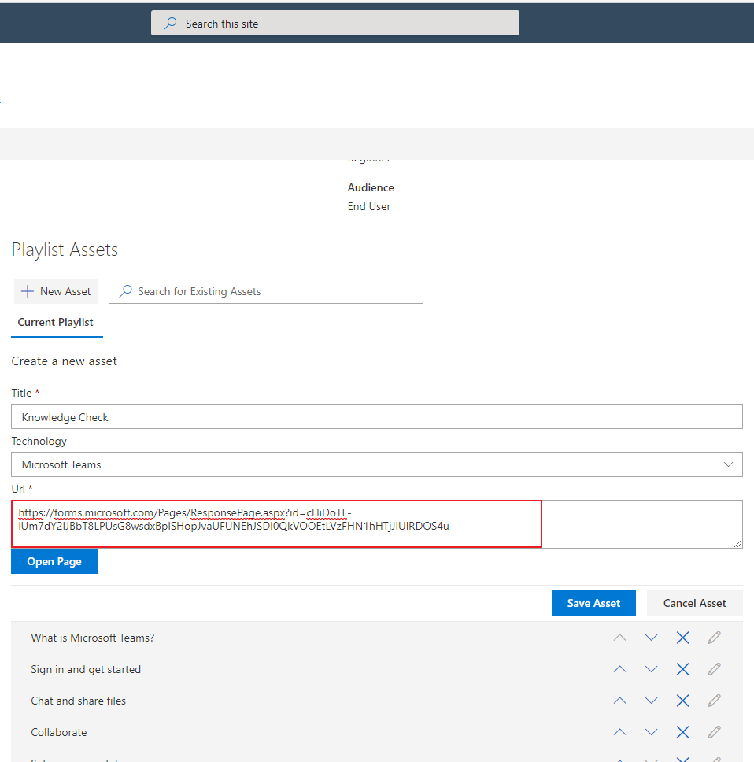

# How to implement a Knowledge Check

In this article we will demonstrate how to create a Knowledge Check form and add it to an existing playlist.  This example goes through the process of creating a Knowledge check form in Microsoft Forms, copying an existing playlist and adding the form to the end of the copied playlist.

## Create the Knowledge Check

A Knowledge Check is a simple question and answer form presented to the user at the completion of the training. A simple and effective way to create a Knowledge Check in Office 365 is to create a form using Microsoft Forms.  

The benefit of using Microsoft Forms is that it allows you to quickly create a Knowledge Check that has different types of questions (multiple choice, fill in the blank, yes/no, true/false, etc.).  In addition, you will configure the form to accept submissions from within your organization so that you can track the users responses.  Power Automate can then be used to process the submissions a perform actions such as grading the Knowledge Check and notifying the user or the trainer of training completion.

### Step 1: Create a Knowledge Check Quiz

In this example, a Knowledge Check will be created in Microsoft Forms. We’ll create a form to quiz the user about the Teams Quick Start Learning Path.

#### Create a new quiz

1. In the browser navigate to https://forms.microsoft.com.  Sign in using your Office 365 account if needed.  If this is your first time logging in to Microsoft Forms a welcome screen may appear which you can close.
2. From **My Forms** page, select the **New Quiz** link to create a new quiz.

3. Add a Title to the form (which will also become the form name).  In the **Title** field type, "Teams Quick Start Knowledge Check".  In the **Description** type, "This is the knowledge check for the Teams Quick Start learning path".
4. Underneath the title and description select the link **Add new** to add a new question and then select **Choice** from the options.  This will add a new choice question to the form. 
5. In the question field type the question, "With Microsoft Teams on your PC, Mac, or mobile device, you can?".
6. In Option 1 type, "Pull together a Team".
7. In Option 2 type, "Use chat instead of Email". 
8. Click the "Add Option" link to add another option.  In Option 3 type, "Securely edit files at the same time".
9. Click the "Add Option" link again to add another option.  In Option 4 type, "Customize your Team by adding tabs for notes, websites and apps".
10. Click the "Add Option" link again to add another option.  In Option 5 type, "All of the above".  Mark this question as the correct answer.  Give the question a point value of "1".

11. Select the **Required** option to make sure that this question has a response when the form is submitted.
12. Add additional questions as needed to complete the Knowledge Check.  You can use choice for multi-select type questions and yes/no type questions as well.  

> [!TIP]
> To read more about creating a quiz in Microsoft Flow refer to the following article, [Create a quiz with Microsoft Forms](https://support.office.com/en-us/article/create-a-quiz-with-microsoft-forms-a082a018-24a1-48c1-b176-4b3616cdc83d?ns=MICROSOFTFORMS&version=16&ui=en-US&rs=en-US&ad=US).

13. When you have completed adding all of the questions you wish to have on the Knowledge Check click the **Share** link in the top right of the page.  This will display the form information panel where you can verify that **Send and collect responses** for your form is set to, **Only people in my organization can respond**.
14. From here you can also copy and save a link directly to the form by selecting the **Copy** link next to the form's address.

15. Check the settings for the form by selecting the more **...** link at the top right of the page.  This will open the settings panel.  Here you can set the options for recording the name of the user submitting the form and whether they can submit the form more than once.  Under **Options** you can customize the Thank You message and set different response options.

>[!TIP]
> To read more about changing the settings on your form refer to the following article, [Adjust your form or quiz settings in Microsoft Forms](https://support.office.com/en-us/article/adjust-your-form-or-quiz-settings-in-microsoft-forms-f255a4ba-e03c-4e12-b880-f7e8b62e0665?ns=MICROSOFTFORMS&version=16&ui=en-US&rs=en-US&ad=US)

## Copy an existing playlist

Since you cannot edit the included playlists you will need to create a copy of the existing Teams Quick Start playlist in order to add a Knowledge Check.  This is also a way to customize the included playlists.  The example here is to create a copy of the included Teams Quick Start playlist and rename it with the organization name.  Additionally, you can then hide the included playlist so that users aren't confused with two playlists that have similar names.

### Step 2: Copy an existing playlist

1. Navigate to the **Custom Learning Administration** page in your site experience.
2. Click on the **Microsoft Teams** category
3. Click on the **Teams Quick Start** playlist

4. Click on the link, **Copy Playlist**

5. Click **Edit Detail** to rename the new playlist.

6. Rename the playlist to, "Contoso Teams Quick Start"

## Add the Knowledge Check to the playlist

Now that a new playlist has been created you can add the Knowledge Check form to the end of the playlist.  This will give users the opportunity to demonstrate what they have learned by going though the training.  This will also give the administrator a way to track that the user had completed the training.  When combined with a Flow from Power Automate, the form can then be used to things like grading the quiz and sending feedback and saving responses to SharePoint for further reporting.

### Step 3: Add Knowledge Check to the playlist

In this step, you’ll add the Knowledge Check to the playlist.  Since we have created a copy of an existing playlist we can now edit the new playlist and add the Knowledge Check form as an asset.

1. Navigate to the **Custom Learning Administration** page in your site experience.

2. Make sure **Microsoft Teams** is selected, then select the **Contoso Teams Quick Start** playlist you created in Step 2.

> [!NOTE]
>You are going to add the Knowledge Check form using the URL that you captured earlier from the information panel of the form using the **Share** link.

3. Click on the **New Asset** option in the Playlist Assets dialog
4. Give your asset a **Title**. Select **Microsoft Teams** from the Technology drop down.

5. Click on the **Enter URL** option

6. Enter in the URL of of the form you created in Step 1.

7. Click **Save Asset** to add it to the custom playlist
8. Click **Close Playlist** to save

Your playlist with the Knowledge Check will now be available anywhere you have installed / embedded the Custom Learning webpart. Alternatively, you can create a Site Page and use the Forms web part to add the form to the Site Page.  You can then use the Site Page as an asset for the playlist.

### Things to Think About

A Knowledge Check can be a great way to get feedback from the user and assess what they have learned using the training.  As each user will fill out the form and submit their name and responses are captured.  You can create a Flow to record these responses as well as the user information as well as the time and date stamps for auditing training activity.  

### Next Steps - [Drive Adoption](driveadoption.md)
